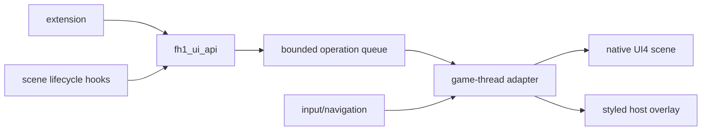

# FH1 UI API foundation

Status: API and research foundation implemented. Native additive controls are
blocked at a documented UI4 ownership boundary and remain default-off.

## Outcome

The first public API is `pinyon_shift::ui::Api` in
`src/ui/fh1_ui_api.{h,cpp}`. It gives extensions stable scene handles and a
bounded operation queue instead of exposing guest addresses, PPC registers,
or UI4 record layouts.

The supported operations are:

- `SceneReady` and `SceneClosing` for lifecycle ownership.
- `SetText` and `SetVisible` for existing components.
- `AddMenuItem` and `RemoveComponent` for extension-owned controls.
- `Drain` for the game-thread adapter.

Handles carry a generation. Closing or replacing a scene invalidates old
handles and removes their queued work. Component IDs are unique within an
active scene. Inputs and queue size are bounded. The API is independent of the
rendering backend so callers can use the same operations for a native UI4
adapter or a host overlay.

## Architecture



The game thread owns all guest UI changes. Extensions only enqueue operations.
The adapter resolves semantic IDs such as `pause.menu.multiplayer`; guest
addresses stay private and are rediscovered for each scene generation.

Native UI4 is the preferred backend because it preserves the title's fonts,
animation, localization, focus, sounds, and controller behavior. A host
overlay is appropriate for new HUD widgets while native construction is still
being qualified. Its theme must be sampled from the active scene rather than
invented by each extension.

## Proven behavior

The repository contains two separate proofs:

1. Existing-screen modification is proven by the default-off `label_patch`
   experiment. It changes the pause-menu `MULTIPLAYER` label to `PINYONSHIFT`
   inside the title's LSB2 string-table route. The stock UI continues to own
   layout, font, focus, animation, and rendering.
2. The API contract is covered by `pinyon_shift_fh1_ui_api_tests`: lifecycle,
   stale handles, duplicate IDs, removal, and queue capacity.

Native insertion research reached a precise boundary. The
strict encoder in `tools/fh1-ui-scene-insert.py` round-trips the stock
`925_PAUSE_MENU.bgf` byte-for-byte and produces a structurally complete eighth
row. It updates item, property, relation, relationship-child, identity, style,
track, animation, key, and declared-byte counts together. The runtime stream
adapter serves the longer member past the stock end-of-file.

The title constructs eight `CPauseMenuButton` instances, but the pause owner
still fails in `sub_8281BBA8` while initializing the duplicated control's
scaler bindings. The experiments isolated three distinct identity domains:
item-value identities, the row's 72 property identities, and shared action
identities. Copying the first two produces the cloned owners and bindings, but
the binding lookup still returns a raw identity or null instead of a UI object.
Renaming the action identities leaves the cloned owner unbound. This is a scene
binding contract, not an eight-entry list capacity limit, and broad pointer or
RTTI guards would only hide the invalid graph. Keep the experiment default-off
until the acceptance test below passes.

The latest evidence is in runtime logs `20260921T003312Z-p23120.jsonl` and
`20260921T003420Z-p38220.jsonl`. The first reaches cloned scaler bindings whose
values are raw identity indexes; the second proves that remapping every known
identity domain still leaves the cloned owner without registered bindings.

## Public API examples

Scene lifecycle:

```cpp
pinyon_shift::ui::SceneHandle pause;
ui.SceneReady("pause_menu", generation, &pause);
ui.SetText(pause, "pause.menu.multiplayer", "PINYONSHIFT");
ui.SceneClosing(pause);
```

Navigation-owned menu item:

```cpp
ui.AddMenuItem(pause, "pinyon.settings", "PINYON SHIFT", 7);
// The adapter creates the visual, registers it with the scene focus provider,
// and dispatches activation by this semantic ID.
ui.RemoveComponent(pause, "pinyon.settings");
```

HUD widget lifecycle:

```cpp
pinyon_shift::ui::SceneHandle hud;
ui.SceneReady("hud", generation, &hud);
ui.SetText(hud, "pinyon.telemetry", "ABS  ON");
ui.SetVisible(hud, "pinyon.telemetry", true);
ui.SceneClosing(hud);
```

These examples describe the stable caller contract. Queue admission is the only
implemented result today. A backend must not advertise `AddMenuItem` support or
report successful application until the native insertion qualification passes.

## Actionable task list

### Foundation — complete

- [x] Define scene generations and reject stale handles.
- [x] Bound IDs, labels, and the cross-thread operation queue.
- [x] Enforce extension-owned component ID uniqueness and reversible removal.
- [x] Add queue and lifecycle tests.
- [x] Prove an existing FH1 label can be changed through the native resource
  path without replacing the renderer.
- [x] Build a strict, byte-identical UI4 parser/re-encoder for pause-scene
  research.
- [x] Extend the scene stream adapter so a re-encoded member can be longer than
  the stock member.

### Production adapter — next

- [ ] Move the verified label target into a semantic component registry and
  consume `SetText`/`SetVisible` operations on the game thread.
- [ ] Return per-operation completion status; do not treat queue admission as
  proof that a guest mutation succeeded.
- [ ] Emit `SceneReady` from the native scene-open boundary and `SceneClosing`
  before guest objects are released.
- [ ] Add activation callbacks keyed by extension component ID.
- [ ] Route controller, keyboard, and mouse activation through the title's
  existing focus and action dispatchers.

### Seamless style layer

- [ ] Record reusable style tokens from UI4 scenes: font alias, text color,
  selected/unselected colors, margins, row height, transition duration, and
  focus sound.
- [ ] Provide one high-level `MenuItem` renderer and one `HudLabel` renderer;
  defer buttons, toggles, and choice rows until a real extension needs them.
- [ ] Use native UI4 components when the target scene exposes a safe template.
- [ ] Use the host overlay for additive HUD content, applying the sampled tokens
  and the title's safe-area scaling.
- [ ] Verify 16:9 and ultrawide placement, controller-only navigation, and
  localized text expansion.

### Native insertion qualification

- [x] Distinguish shared lookup tokens from row-owned identity slots.
- [x] Clone the row's relationship actions, style records, tracks, and keys.
- [x] Distinguish item-value, property, and action identity domains.
- [x] Prove the failure is scaler-binding registration, not list capacity.
- [ ] Recover how the animation loader registers a cloned owner's scaler
  bindings, including the key that maps a style path to its live UI object.
- [ ] Encode that registration contract without pointer, RTTI, or tree-walk
  guards.
- [ ] Open the pause menu with eight rows and keep it open for 300 frames.
- [ ] Focus the eighth row with controller input, activate it once, close the
  menu, reopen it, and repeat.
- [ ] Run the same script three times with no access violation, fast-fail,
  leaked component, stale callback, or save mutation.
- [ ] Capture before/focused/activated frames and retain the session event log.
- [ ] Only then connect `AddMenuItem` to the native UI4 backend.

## Acceptance tests

Build and API tests:

```powershell
& .local/toolchain/cmake-3.31.10-windows-x86_64/bin/cmake.exe `
  --build out/build/win-amd64-release --config Release `
  --target pinyon_shift pinyon_shift_fh1_ui_api_tests --parallel
& out/build/win-amd64-release/pinyon_shift_fh1_ui_api_tests.exe
```

Encoder round-trip:

```powershell
python tools/fh1-ui-scene-insert.py `
  --input .local/ui-verify/925_PAUSE_MENU.bgf --check-roundtrip
```

Gameplay qualification must use `tools/launch-preview.ps1` and the installed
preview state root documented in `AGENTS.md`. Verify the profile exists before
launching and never copy, reset, or overwrite save files for a UI test.

## Failure and recovery

All experiments are default-off. Unset the related environment variables to
return to the stock scene:

```powershell
Remove-Item Env:PINYON_SHIFT_UI_EXPERIMENT -ErrorAction SilentlyContinue
Remove-Item Env:PINYON_SHIFT_UI_SCENE_INSERT_FILE -ErrorAction SilentlyContinue
Remove-Item Env:PINYON_SHIFT_UI_SCENE_EXPECT_DECLARED -ErrorAction SilentlyContinue
```

If an extension operation fails, discard it, close the scene handle, and let
the title keep its stock UI. Never patch save data as a UI recovery mechanism.
The native insertion route remains a development experiment until every item
in its qualification list is checked.
