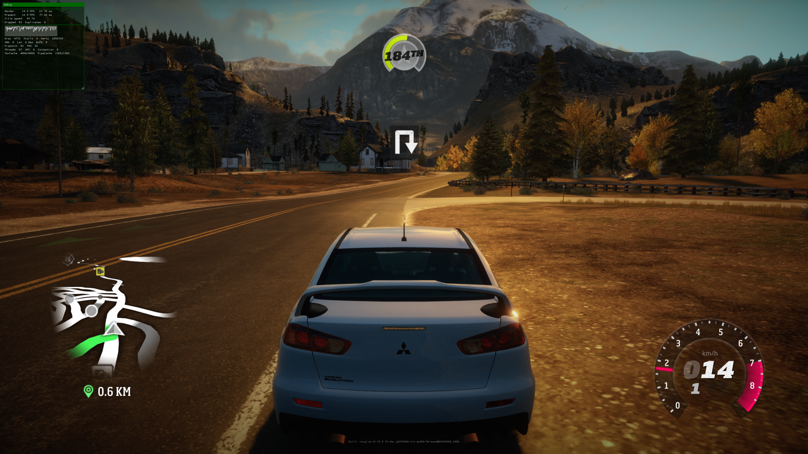

# Manual playtest feedback - 2026-09-07

Status: recorded for later investigation. These are user observations, not diagnosed causes.

Test context: latest validated local preview launched with the existing installed AppData save. Renderer DLL SHA256: `75521DA21DBAC16D95CA6C6F9E11640A5A601A393E86C6D4192044782A3863E4`. Experimental full C347/21B70 terrain pair remains disabled.

## General driving

- User reports solid performance, around **70 FPS** during general driving.
- This is a manual observation, not a controlled benchmark or minimum-hardware claim.

## Animation timing

- [ ] Investigate animations that appear sped up, especially NPC animations.
- [ ] Check title-screen UI transitions; user is less certain about these.
- Follow-up: compare animation duration against elapsed real time at different frame rates; check whether affected animation/UI clocks depend on render frequency. Frame-rate coupling is a hypothesis, not an established cause.

## Severe area-specific slowdown

- [ ] Reproduce the severe frame-rate drop and choppiness in the pictured area.
- User reports that performance becomes good again after leaving the affected area; similar drops occur in some other areas.
- Screenshot overlay shows approximately **14.8 render FPS (67.75 ms)** and **12.9 present FPS (77.43 ms)** at this moment.
- Visual reference: road beside a small group of houses, rocky wooded hills and a large mountain ahead; white Mitsubishi Lancer Evolution X, navigation distance 0.6 km. Exact map location/coordinates are not established. Preserve the minimap and camera direction in the screenshot for reproduction.
- Follow-up: identify this location, capture an approach/inside/exit sequence with frame-time and CPU/GPU workload data, and check whether the slowdown persists while stationary or changes with camera direction. Determine the bottleneck before changing rendering or simulation behavior.

Original screenshot preserved at full resolution. No runtime changes were made while recording this feedback.
