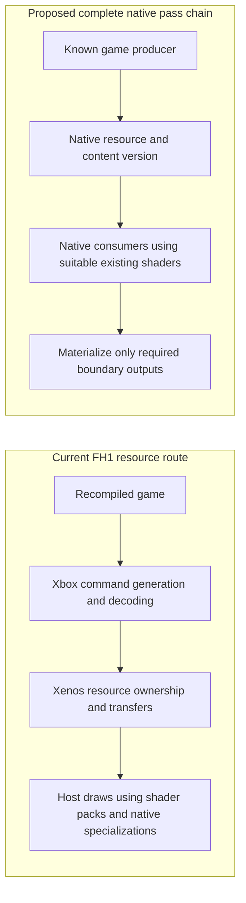

# Xbox 360 native renderers: architecture, performance, and implications for FH1

## Findings

Implementation follow-up: [native resource migration checklist](NATIVE_RESOURCE_MIGRATION_CHECKLIST.md)
defines ordered tasks and completion criteria. Its starting-point status includes
subsequent rejected experiments; consult it before following this research snapshot's
suggested first experiment.

**The strongest opportunity for FH1 is to remove expensive resource and submission work at the game-renderer boundary.** Rewriting more individual shaders can help, but it does not by itself remove Xbox command processing, render-target ownership changes, format reinterpretation, or repeated resolve/conversion/copy chains. The projects examined here offer concrete examples of moving that boundary, with different amounts of compatibility machinery remaining.

The best references are **Unleashed Recompiled**, **re:Blue**, **Skate 3 Recomp**, and **Marathon Recompiled**. They are useful for different reasons: mature graphics API replacement, explicit resource-history management, incremental replacement of a working ReXGlue renderer, and removal of console-specific tiling decisions. Their approaches are detailed below with source links. None supplies a defensible FPS multiplier for Forza Horizon 1.

The recommendation is to keep the measured P2 transfer investigation and make its next architectural milestone **one complete resource lifetime under native ownership**, including its producer and consumers. Use the existing translated shaders where suitable. Measure how much work disappears before expanding to another family. This report recommends changes in emphasis; it does not replace the [working backlog](NATIVE_RENDERER_BACKLOG.md) or declare any P2/P3 item complete.

## Scope and evidence

Evidence snapshot: **2026-09-08 Mexico City / 2026-09-09 UTC**. Public repository implementations, official documentation, release notes, and clearly attributed developer statements are distinguished from analysis. A source inspection establishes that an implementation exists; it does not establish whole-game correctness or reproduce a benchmark. Current development branches are identified separately from releases.

FH1 comparisons refer to the latest qualification records in [P2 dependency ranking](P2_DEPENDENCY_RANKING.md), [performance checkpoint](NATIVE_RENDERER_PERFORMANCE_CHECKPOINT_2026-09-04.md), and [discovery findings](DISCOVERY_FINDINGS_2026-09-08.md). This repository has uncommitted work; its HEAD alone does not identify the qualified renderer. The last qualified runtime in those records is `87B79AABEC3F06326DF616DC02CCC3588E1CFFEFEE3A4E2B3590A17655EA23B5`. Subsequent experimental source is not treated as a retained improvement.

Three distinctions matter throughout:

1. **Native CPU execution:** PowerPC code has been recompiled. The graphics path can still emulate Xenos.
2. **Native shader code:** shaders execute as DXIL/DXBC/SPIR-V, potentially generated ahead of time. Their resource and output semantics can still implement Xbox GPU behavior.
3. **Game-specific native rendering:** a replacement controls some or all game resource lifetimes and rendering operations directly through a host graphics API. Remaining compatibility work must still be inventoried.

Xenos is the Xbox 360 GPU. **XenosRecomp** is a shader-conversion tool; it is neither Xenia nor a complete game renderer. A project can use that tool while bypassing GPU emulation. [XenosRecomp documentation][X1]

## Why Xenos-compatible rendering can remain expensive

Xbox 360 render targets share a small EDRAM address space. A PC renderer normally uses independent texture objects. Preserving the console's cross-format and cross-sample-count reuse can require transfers between those objects. Xenia's 2021 render-target rewrite reduced redundant copying through range ownership; its ROV alternative implements more output-merger behavior in shaders, with costs such as losing normal early-depth optimizations. This is historical architectural evidence, not a current Canary benchmark. [Xenia render-target architecture][XE1]

Current Canary documentation still distinguishes the faster conventional RTV path from the ROV path for additional accuracy in some cases. Its source describes layout changes and copying as an RTV performance limitation. **FH1 already uses host render targets and excludes the ROV shader ABI**, so switching away from ROV is not an unclaimed optimization available to our current baseline. [Canary options][XE2], [Canary render-target implementation][XE3], [FH1 shader-pack/runtime contract](SHADER_PACK_FORMAT.md)

The important question is therefore what forces a transfer to exist. Making its shader shorter optimizes the existing representation. Giving a complete pass chain suitable native resources may avoid the representation change altogether. The latter requires understanding history, partial writes, and the next consumer; it is an architectural hypothesis until an FH1 implementation demonstrates it.

## Unleashed Recompiled

### Architecture and resource lifetime

Inspected source: `cf829a9eca8fb680fba4b0409ddeb6ca92f22e3c`; published release reference: v1.0.3. Development-source details are not assumed to describe every release binary.

The renderer replaces guest texture/surface/buffer creation, drawing, state, copy, and presentation functions. `StretchRect` can retain a dependency instead of immediately copying; a non-MSAA consumer can sample the source surface. Conflicting later operations trigger materialization. Other shortcuts depend on title knowledge, including transient depth lifetimes and a shadow path that redraws objects rather than copying their shadow texture. [Graphics implementation][U1]

Its resource types attach host textures, views, descriptors, layout, dimensions, and format to guest objects. A texture can refer to its source surface; buffers own host buffers. This is a useful concrete model for separating a game's logical resources from the console's storage mechanism. [Resource declarations][U2]

**FH1 implication:** the unit worth replacing is a resource's lifetime through several operations. A native draw that republishes into the same Xenos targets can preserve compatibility, but it may leave subsequent transfers intact or introduce an additional publication copy. Our older [retained-pass publication experiment](RETAINED_PASS_OUTPUT_PUBLICATION.md) illustrates that cost boundary; it should not be mistaken for an independent native frame path.

### Shader and submission techniques

XenosRecomp supports native vertex input declarations, upload-time endian conversion with title-specific corrections, and specialization. Its documented omissions include integer constants, dynamic register indexing, and memory export. These assumptions fit its target workload; they are not a safe global specification for FH1. [Shader translator scope][X1]

The shared shader header supplies bindless texture/sampler arrays and packed-input helpers. The generator deduplicates shader containers, compiles a hash-indexed cache, and compresses its output. The compiler has distinct DXIL and SPIR-V targets. This is a combination of translated material shading and a different host interface, without requiring a handwritten replacement for every material. [Shader bindings][X2], [Cache generator][X3], [Compiler implementation][X4]

A render thread consumes batches of queued commands; this does not establish merged geometry draws. Pipeline workers integrate with asset readiness. A dedicated copy queue is present, but its upload helper also uses a mutex and waits on its fence: it would be inaccurate to describe all uploading as wait-free. [Graphics implementation][U1]

A checked-in PSO inventory describes known combinations of shaders, vertex layouts, formats, and state. For FH1, which already has offline packs and startup catalogs, the additional question is whether all needed combinations are ready before their first use. A new pipeline scheduler is not justified by the current transfer hotspot alone. [Pipeline inventory][U3], [FH1 artifact production](P1_ARTIFACT_PRODUCTION.md)

### Fidelity, timing, and lower-end support

Unleashed's depth-resolve shader selects depth samples without supplying a stencil-preservation contract. It is not a replacement for FH1's D24S8 1x-to-4x reinterpretation. Its handwritten Gaussian blur is another example of implementing an effect directly, but says nothing about the benefit of reducing our filter taps. [Depth resolve][U4], [Gaussian blur][U5]

High-frame-rate patches separately address camera interpolation, frame-counted game behavior, character motion, and particles. That separation is relevant to our NPC/UI animation reports: improved rendering throughput cannot be assumed to fix update timing. [Frame-rate patches][U6]

The official minimums include AVX-capable Sandy Bridge/Bulldozer CPUs, 8 GB RAM, and GPUs such as the **Kepler GT 630, Radeon HD 7750, or Intel HD 510**, with the stated modern API support. These are compatibility requirements, not a promised frame rate. The documentation acknowledges CPU-heavy areas and synchronous work that can cause hitches. No controlled same-scene, same-hardware Canary multiplier was established by these sources. [Official requirements and limitations][U7]

Release v1.0.3 includes fixes for Intel integrated-GPU streaming/loading, MSAA availability, and reflections, and changes automatic Intel backend selection to Vulkan. Native architecture still needs adapter-specific qualification. [Release notes][U8]

## re:Blue: Blue Dragon

### An independent graphics route with translated shaders

Stable v1.0.0 is `957ac623199ebb3cfe40f6af28bc4958490b6067`, released August 27, 2026. The newer development snapshot examined here is `ff2196bdb54c50dc40f84ccb0505ca4b6d259e9d`, published in the September 9 UTC nightly. The following details refer to that development snapshot unless stated otherwise. [Stable release][B1], [nightly release][B2]

Application setup explicitly assigns `RuntimeConfig.graphics = nullptr` and initializes its own Plume renderer. Device hooks replace GPU ring-buffer operations as well as device operations; separate draw/state hooks supply the native graphics path while maintaining guest device data that the game reads. This is source evidence of bypassing the SDK renderer, rather than merely renaming it. [Application setup][B3], [device hooks][B4], [draw hooks][B5], [state hooks][B6]

Its build generates a shader cache using XenosRecomp, including prelinked D3D12 specialization combinations. Runtime lookup selects the corresponding modules; Vulkan specializes during pipeline creation. Small targeted replacements coexist with the translated corpus. Two bloom-mask replacements restore saturation behavior that would otherwise change when using FP16 postprocessing. **Translated shaders and independent resource/submission ownership are compatible.** [Cache build][B7], [prelink generation][B25], [shader lookup and substitutions][B8]

### Deferred resolves with explicit history

The native framebuffer code still reconstructs title-specific EDRAM history from known outputs. It tracks fullscreen and smaller offscreen chains and seeds targets when blending requires prior contents. Binding a target materializes relevant deferred dependencies before an overwrite. Thus native rendering removes generic hardware emulation while retaining the history that affects the visible result. [Framebuffer implementation][B9]

Lazy resolve admission is deliberately narrow: a drawn, live, single-sample source; matching dimensions and format; no exponent scaling; and suitable non-cube, single-mip destination. Consumers can sample the source directly. Mutation, destruction, or an incompatible use materializes the required copy first; superseded dependencies may never need copying. Guessed fallback contents are excluded from alias admission, and incompatible cases retain a real native copy or resolve. [Resolve implementation][B10]

This addresses a central FH1 failure mode: a source surface is reused while earlier contents must remain available. Our captured scaled-resolve chain includes reads before assembly is complete, so replacing every destination with a source pointer is invalid. A successful native path must preserve versions and partial regions at the point they become observable. [FH1 scaled-resolve history investigation](P2_DEPENDENCY_RANKING.md)

Blue Dragon's color/depth resolve helpers average color and select minimum depth for their consumers. They do not establish an implementation for arbitrary stencil transfer or mixed-format reinterpretation. FH1 cannot substitute those helpers for the measured wrapped D24S8 transfer merely because both operations are called a resolve. [Color resolve][B11], [depth resolve][B12]

### Resources, preparation, and quality settings

Several other mechanisms are directly inspectable:

| Technique | Implementation | FH1 relevance |
|---|---|---|
| Model-allocation buffers | One host buffer can cover a model's physical allocation, with mesh offsets. [Physical buffers][B13] | Investigate allocation identity and reuse before importing each draw range separately. |
| Native texture mirrors | Allocation-time conversion builds host resources; draw lookup does not create missing mirrors. Replacement invalidates old mirrors. [Texture mirrors][B14] | Move known conversion/preparation out of the first visible draw, while preserving mutation tracking. |
| Surface pooling | Pools by texture properties, tracks bytes, and trims idle resources against adapter budget. [Surface pool][B15] | Avoid repeated allocation without treating a larger cache as a substitute for correct lifetime. |
| Predicted pipeline preparation | Material/technique/layout knowledge feeds workers that prioritize current loading. [Predictor][B16], [workers][B17] | A targeted first-use-hitch technique if FH1 measurements identify missing PSOs. |

The development renderer chooses supported D24S8 on NVIDIA/Intel D3D12 and otherwise D32FS8. An optional R11G11B10 HDR target remains **disabled by default**. It reduces nominal bytes per affected texel, but loses alpha and precision; this is not a claim that total VRAM halves. [Format selection][B18], [defaults][B19]

The newer **Low preset** selects 75% scene scale, no MSAA, 1024-pixel shadows, half-resolution postprocessing, and reflections off. A 1280x720 design floor limits downscaling. These controls differ from stable v1.0.0 and must be identified in performance comparisons. This is a concrete lower-cost quality policy, separate from removing redundant work. [Settings and presets][B19], [engine scale hooks][B20]

The official minimum hardware table lists an i5-4460/Ryzen 3 1200-class CPU, 8 GB RAM, and GTX 1050 Ti/RX 570-class GPU. It does not specify a guaranteed scene/resolution/FPS target. No controlled current-Canary A/B was established. Source/platform claims also should not be confused with available downloads: the inspected release workflow disables macOS jobs despite macOS appearing in project documentation. [Requirements][B21], [release workflow][B22]

The engine separates a 30 Hz simulation clock from render interpolation. Recent interpolation fixes cover animation and matrix handling. For FH1, this reinforces the need to qualify animation duration and motion independently of presentation FPS. [Frame clock][B23], [interpolation][B24]

## Skate 3 Recomp

### Native scene rendering with remaining emulated dependencies

Inspected main: `f6e0ae87fdfecbadb5c1e36c55d66a744187a3cd`; SDK submodule: `7eb0faf7787f5e01333c228b8e3f03c32f7295ea`. The v2.0.0 release introduced the native renderer; current-source details are not automatically attributed to that release's benchmark. The README provides live renderer switching and automatic fallback and acknowledges untested content and visual issues. [Project status][S1], [v2 release][S2]

Hooks capture scene lists, meshes, dynamic state, bones, and lifetimes. The native frame is assembled from this information. A filtered guest draw list can avoid material setup and packet generation for selected occluded static entries, then restore the original list. This is an example of reducing CPU work above GPU packet interpretation. Its ordering and side effects are title-specific. [Scene capture hooks][S3]

Host resources include converted mesh layouts, cached vertex/index buffers, worker texture decode, and render-thread uploading. The implementation specifically avoids reading write-combined upload memory on the CPU; source comments attribute a class of large decode stalls to that mistake. Treat the reported timings in those comments as an implementation diagnosis, not an independently reproduced benchmark. [GPU resources][S4]

The source has explicit cache pressure and payload-mutation handling, but also visible compromise paths: periodic texture revalidation, rejection of malformed stretched skinned draws, and temporarily unavailable cold resources. Its material shaders combine captured families with empirical fallbacks. This is useful evidence of both the potential and the qualification burden of a scene-level replacement. [Lifetime/configuration][S5], [material shader][S6], [water families][S7]

**The inspected implementation has not fully retired Xenos.** Its SDK suppression policy preserves PM4 parsing, fences, queries, memexport, and selected composition work. The default mode exempts 1024-pitch lightmap composition and surfaces of pitch at most 512 from pitch-based suppression; a separate gate still suppresses depth-only draws. Other modes preserve menu render-to-texture cases. These are compatibility dependencies even when the displayed scene is native. [Suppression policy][S8], [execution gates][S9]

D3D12 execution gates apply to draws and resolves. Their comments document that suppressing lightmap production broke ground textures, while retaining an obsolete guest postprocessing chain left substantial work running behind native output. The useful lesson is to remove a replaced pass **and** the unneeded work feeding it, while preserving outputs that still have consumers. A surface-pitch heuristic is not a sufficient FH1 pass-identity contract. [Command-processor gates][S9]

### What the dramatic performance claim establishes

The author's launch announcement reports **more than 2x FPS at roughly one-quarter GPU power** against its old emulated renderer, excluding optional enhancements. It separately reports approximately **25 to 250 FPS at 4K on an M4 Pro**. These are author demonstrations, not reproduced measurements or a version-pinned comparison against current Xenia Canary. The announcement lacks repeated-run frame-time distributions and a complete settings, scene, thermal, and power protocol. [Developer announcement][S10]

The two examples should not be combined into one ratio, and the maximum-FPS result does not establish power consumption at a fixed playable frame rate. No explicit minimum CPU/GPU/RAM matrix was found in the inspected project documentation. A large improvement in one scene/API/hardware path remains evidence of potential, not a requirement specification for another game. [Project documentation][S1]

This is the closest comparison for incremental FH1 migration: a working ReXGlue game can replace substantial scene rendering while retaining explicitly identified compatibility passes. It also demonstrates why performance success and complete dependency retirement need separate acceptance criteria.

## Marathon Recompiled: Sonic the Hedgehog (2006)

Marathon here means the Xbox 360 Sonic 2006 port, **not Marathon: Durandal**. The inspected revision is `bd9c0bbd8a99bcc2c0fabdf9521462e75e0ae7d8`. Its README identifies XenonRecomp/XenosRecomp and explicitly describes development builds as not intended for public use. No qualified requirements matrix or controlled Canary performance comparison was established. [Project status][M1]

The graphics implementation hooks resource creation, binding, clears, shaders, and draw calls and allocates native surfaces with host sample counts. A particularly relevant `SurfaceSize` hook returns zero to prevent the game from choosing tiled rendering because of the Xbox's 10 MB EDRAM limit. Resolve processing uses host-supported or shader paths as needed. Source comments still contain unresolved surface-alias assumptions, so this is an architectural example rather than a complete correctness recipe. [Native graphics and tiling hook][M2]

**FH1 inference:** a console-specific producer decision can generate work that no optimized transfer kernel will remove. We should trace why FH1 creates and alternates its depth representations. This report does not establish that FH1 has an equivalent safe `SurfaceSize` override, that its tiled passes can already be suppressed, or that changing its MSAA count preserves every consumer.

## Other projects and misleading comparisons

The broader survey found additional recompilations, but source/status distinctions prevent counting all of them as independent native-renderer successes:

| Project | Verified public evidence | Classification for this comparison |
|---|---|---|
| PGR4-Recomp | Native renderer remains an unchecked future-plan item. [Roadmap][O1] | Relevant racing project to watch; no completed renderer technique established here. |
| TiP-Recomp | Author defers native rendering yet reports large FPS gains over uncapped Xenia; its optimized SDK requires private access. [README][O2] | Counterexample to attributing every recompilation gain to native graphics. Numbers are author claims without an auditable matched protocol. |
| The Crash Course Collection | Official site advertises native renderers for Crash Course 1 and 2; project listing says WIP. [Project site][O3] | Announced native implementation; no inspected renderer source or controlled performance data sufficient for technique transfer. |
| reNut / Nuts & Bolts | Published configuration selects `gpu_plugin = "xenos"` and disables several effects. [Configuration][O4] | GPU-emulation and quality-reduction example, not demonstrated Xenos retirement. |
| The Simpsons Game Recomp | README describes a Xenia-derived graphics route and native rendering as migration work. [Roadmap][O5] | A migration project, not completed native-renderer evidence. |
| DownpourRecomp | Release history says a native-render experiment was removed; separately lowers CPU instruction-set requirements. [Release history][O6] | CPU launch compatibility can improve without native renderer completion. |
| Banjo: Recompiled | Uses the N64 recompilation route. [Project][O7] | Excluded: sharing a franchise with an XBLA release does not make it an Xbox 360 renderer comparison. |

This is an evidence-based shortlist, not a claim that no other projects exist. Public announcements without inspectable implementations or reproducible measurements cannot carry the same architectural or performance conclusions as the four detailed examples.

## FH1: what the current evidence actually identifies

Our compiler-free shader packs, exact native specializations, video upload, and instrumentation are useful foundations. They have not yet removed the broad dependency on Xenos command interpretation, resource ownership, and transfers. Counting covered draws or shader-pack entries as equivalent to native resource ownership would hide the remaining work. [Shader pack](SHADER_PACK_FORMAT.md), [backlog P2/P3](NATIVE_RENDERER_BACKLOG.md)

The strongest current resource measurement is:

| Observed work | 1x resolution | 2x resolution | Interpretation |
|---|---:|---:|---|
| Ordinary render-target transfer intervals | 1.435 ms/frame | 5.683 ms/frame | Strong resolution sensitivity; not all removable time |
| Transfer calls with resolve-clear arguments | 0.202 ms/frame | 0.280 ms/frame | Contains more than the clear API operation |
| Largest audited ordinary transfer list | Not paired | 1.572 ms/frame | D24S8 1xMSAA to 4xMSAA, four calls/frame in the audit |

The first two rows come from one diagnostic run per scale, 11 sampled source frames each, with similar call counts. The third comes from a separate verbose contract audit. Intervals include transfers, barriers, and related work; they overlap earlier pass timing and are not independent values to add to frame time. GPU timestamps can include stalls. These are attribution results, not a controlled FPS gain. [Direct transfer timing and contract audit](P2_DEPENDENCY_RANKING.md)

The dominant depth transfer is especially instructive. On the tested NVIDIA adapter, the D3D12 feature query reports no pixel-shader-specified stencil reference support. The captured implementation consequently uses a depth draw and eight stencil-bit draws. An address-calculation shortcut reproduced captured output but failed repeated performance retention. This argues for investigating whether work can be eliminated, rather than repeating that unchanged arithmetic optimization. [D24S8 experiment](P2_DEPENDENCY_RANKING.md)

The sampled stencil contents were zero, but that does not establish a safe global skip. Incoming color/depth transfers can repopulate a previously cleared surface, and other FH1 passes use stencil. Provenance must include those producers. The newest ranking proposes detection of required source stencil content; this report does not treat that experiment as a qualified optimization. [Stencil content, writer, and provenance audits](P2_DEPENDENCY_RANKING.md)

Previous direct-texture-output, RGBA8-extension, geometry-ownership, and reduced-filter experiments also lacked qualifying performance results. Their rejection does not prove that native resources cannot help. It shows that a replacement retaining the surrounding conversion/history/synchronization work can cost as much or more than the original. The next experiment needs an explicit accounting of the operations it removes. [Experiment records](P2_DEPENDENCY_RANKING.md)

The user-marked Outpost, plaza, highway, and canyon windows remain essential qualification scenes. Sparse sampled pass outliers do not establish a steady shader bottleneck, and lowering effect quality without attributing the hitch could leave it unchanged. [Manual discovery evidence](DISCOVERY_FINDINGS_2026-09-08.md)

## Comparison with our approach

| Dimension | Unleashed | re:Blue | Skate 3 | Marathon | FH1 qualified direction |
|---|---|---|---|---|---|
| Main interception boundary | Guest graphics API | Guest graphics API and engine hooks | Scene capture plus SDK suppression | Guest graphics API | Predominantly prepared GPU work inside the existing backend |
| Resources | Native guest-object wrappers | Native resources with explicit history | Native scene caches plus retained composition resources | Native surface/buffer objects | Native host targets still governed by Xenos ownership semantics |
| Shaders | Translated corpus and selected helpers | Translated corpus and selected replacements | Material ports and scoped fallbacks | Translated corpus and helpers | Offline translated packs plus qualified specializations |
| Remaining GPU compatibility | Title-specific semantics | Title-specific history/conversions | Explicit emulated passes, PM4 and other side effects | Title-specific semantics; WIP | Broad resource/submission dependencies |
| Best lesson for FH1 | Resource lifetime and copy avoidance | Preserve history while deferring copies | Remove duplicate whole-pass work incrementally | Prevent unnecessary console tiling at its origin | Measure removed work, not just replacement coverage |

Source basis: the project implementation sections above; the FH1 column follows the [current backlog](NATIVE_RENDERER_BACKLOG.md) and [dependency ranking](P2_DEPENDENCY_RANKING.md). This is an architectural comparison, not a ranking of visual correctness or measured speed.

The proposed boundary change is illustrated below. The second route is an FH1 migration target, not an assertion that every operation in the compared projects follows one identical design.

### Recommended work order

These are proposed experiments under the existing P2/P3 goals, not new claims of implementation.

1. **Finish one bounded experiment on the measured transfer hotspot.** Count the depth/stencil work actually avoided and its detection/synchronization cost. Keep uncertain source contents on the correct transfer path. Stop the experiment if it produces no repeatable benefit; do not keep changing arithmetic in the rejected address-only candidate. This can produce an incremental gain while the larger lifetime question is investigated.

2. **Trace the logical producer and consumers of one expensive surface chain.** Record creation, clear, draw writes, partial writes, resolves, sampling, aliasing, reuse, and final release. For the dominant D24S8 chain, distinguish actual depth/stencil consumers from representation-maintenance work. The deliverable is a concrete contract that explains which data must survive each operation, not another frequency-ranked shader list.

3. **Prototype native ownership across that complete chain.** Reuse existing shaders and D3D12 facilities where their bindings allow it. Preserve an earlier content version before a conflicting write, and materialize only where remaining compatibility consumers require it. Count any new boundary copies. A prototype that removes one copy but adds conversion, synchronization, and publication of equal cost has not achieved the intended optimization.

4. **Use existing engine knowledge to move preparation earlier.** Revisit model/allocation identity, streaming generation, and mutation rather than expanding a draw-range cache blindly. FH1 already has static-world/mesh/provenance documentation, but some layout knowledge still originates after Xenos preparation. Treat those records as leads to revalidate, not an already-complete higher-level API. [Static-world boundary](STATIC_WORLD_PREPARED_LAYOUT.md), [terrain/road controls](TERRAIN_ROAD_RENDER_PATH.md)

5. **Remove command generation only after its consumers and side effects are replaced.** Native output alone does not justify suppressing guest work. Maintain explicit accounting for queries, guest-visible writes, fences, memory export, and render-to-texture inputs. Once a complete chain no longer requires PM4-derived state, bypass its producer path and measure CPU preparation savings. Full P3 retirement still requires a qualification build without the Xenos renderer or hidden fallback.

6. **Add an explicit lower-cost quality profile after attribution.** Candidate controls are AA, individual shadow/reflection resolutions, postprocessing scale, and scene resolution. Establish a visual budget for each changed effect. The objective is a useful setting with measured savings, not a universal 95% accuracy score. Do not combine all knobs in the first experiment, because that prevents identifying their individual costs.

### What to keep and what to avoid

Keep the existing shader-pack pipeline, runtime-translation prohibition, automated routes, discovery markers, exact resource checks, sampled timings with loss reporting, and before/after image checks. They support the new boundary just as well as the current backend. A new graphics abstraction, new cross-platform backend, or wholesale SDK replacement is not needed to test one native resource lifetime.

Avoid making handwritten shader count the primary progress metric. Avoid global stencil/MSAA skips, pointer-only resolve aliasing, or unexplained frame-number assumptions about resource freshness. Avoid importing another title's surface-pitch whitelist or transient-depth rule without proving the equivalent FH1 contract. These shortcuts can produce a plausible screenshot while corrupting a later consumer.

Also avoid repeating features we already possess as new optimization wins: D3D12 rendering, host RTVs, ahead-of-time shader translation, and pipeline caching. The missing benefits must come from new work removed or a demonstrated improvement to how those features are used.

## Performance potential and lower requirements

### What the published hardware claims mean

| Project | Published hardware evidence | Missing qualification |
|---|---|---|
| Unleashed | Minimum examples include Kepler GT 630 / HD 7750 / HD 510; 8 GB RAM. [Requirements][U7] | No fixed FPS/scene/resolution guarantee in that minimum table. |
| re:Blue | Minimum GTX 1050 Ti / RX 570-class, 8 GB RAM; recommended hardware is higher. [Requirements][B21] | No controlled Canary ratio or fixed target attached to the minimum table. |
| Skate 3 | Large developer-reported FPS/power improvements; no explicit minimum matrix found. [Announcement][S10], [README][S1] | Matched settings, frame-time tails, power protocol, and full fallback coverage. |
| Marathon | Development status and platform support. [README][M1] | Released performance target and hardware qualification. |
| Xenia Canary | Generic minimum: AVX/AVX2-capable x86-64, D3D12/Vulkan, 4 GB RAM. Recommended: 6+ cores, GTX 980 Ti or later, 6 GB RAM. [Quickstart][XE4] | Game-specific performance guarantee; the documentation explicitly does not provide one. |

Comparing Unleashed's **minimum** GPU to Canary's **recommended** GPU does not measure a requirements reduction. Nor does comparing different games. A fair requirements claim needs a specified playable target under comparable quality and sustained load, including the difficult scenes.

There are nevertheless plausible routes to lower requirements: fewer full-surface transfers reduce bandwidth demand; avoiding duplicated work reduces GPU execution; persistent resources reduce preparation and allocation churn; narrower shaders or conventional input layouts may reduce per-draw overhead; appropriate quality settings reduce actual pixels/samples processed. Which route matters most depends on the device and the scene.

For example, 2x resolution in each dimension means four times the pixels. Removing a resolution-sensitive transfer can therefore matter much more at 1440p than at 720p. Conversely, a CPU-bound town or streaming hitch may improve little from lower resolution. Our existing 1x/2x probes show a much larger private-memory reduction than frame-time improvement; private memory is not a measurement of dedicated VRAM. [Resolution probes](P2_DEPENDENCY_RANKING.md)

**Realistic conclusion:** these projects justify testing a larger architectural opportunity than shader micro-optimization alone. They do not justify forecasting 2x, 10x, a particular minimum GPU, or a one-day completion time for FH1. The roughly 5.7 ms transfer interval is a target for investigation, not a bank of frame time that can simply be subtracted. Any gain can expose a different CPU or GPU limit.

### Qualification needed before publishing a gain

Use three explicitly labeled baselines where practical: current qualified FH1, candidate FH1, and a pinned Canary build running the same game revision. The current FH1 comparison isolates our change; Canary answers a separate product-level question. Record the actual API and RTV/ROV selection rather than assuming all emulated rendering uses the slower path.

For each result, retain:

- **Workload:** same route/save, camera, weather/time where controllable, traffic and draw-count differences, warm-up, and duration. Include Outpost/plaza, highway/canyon traversal, racing, menus, and streaming transitions.
- **Image workload:** actual internal scene resolution, output resolution, MSAA, postprocessing, shadows/reflections, draw distance, dynamic scaling, and any missing/fallback content. A 4K window alone does not establish a 4K scene render.
- **Timing:** median/p95/p99 frame times, source frames versus presented/interpolated frames, CPU preparation, GPU intervals, and timing losses. Keep profiling runs separate from clean benchmark runs.
- **Memory:** process private bytes, working set, GPU allocation/residency/budget where available, and cache behavior. Separate these measurements instead of describing every reduction as VRAM savings.
- **Hardware:** CPU/GPU, driver/API, RAM, power mode, temperature/clock behavior, and relevant optional features. Include an integrated/UMA GPU and lower-end discrete hardware before changing minimum requirements.
- **Power and correctness:** watts at the same fixed FPS cap as well as uncapped throughput, where reliable measurement is available; NPC/UI animation duration, input/physics/audio, visual motion, and resource-lifetime checks.

Repeated runs with alternating order help distinguish an improvement from warm-up and workload drift. Retention should require useful savings with acceptable frame-time tails and the stated visual contract. A faithful dependency replacement can also be valuable without a speedup when it demonstrably removes a dependency without material regression, as the existing backlog already allows.

## Source references

External sources were accessed for the September 2026 snapshot above. Repository links are pinned wherever source code supports a technical claim; release notes and wiki pages retain their own dates and may change. Local links refer to this project's working documentation, including uncommitted progress.

1. **hedge-dev, Unleashed Recompiled:** [graphics implementation][U1], [resource declarations][U2], [pipeline inventory][U3], [depth][U4] and [blur][U5] helpers, [timing patches][U6], [README][U7]. Source revision `cf829a9e`; [v1.0.3 release notes][U8].
2. **hedge-dev, XenosRecomp:** [scope][X1], [shader interface][X2], [generator][X3], [compiler][X4]. Source revision `990d03b2`.
3. **zolaware, re:Blue:** [v1.0.0][B1] and [September 9 nightly][B2]; source revision `ff2196bd`. Application, resource, shader, settings, and clock implementations are linked individually in the re:Blue section.
4. **mchughalex, Skate 3 Recomp:** [project status][S1], [v2 release][S2]; source revision `f6e0ae87`, SDK `7eb0faf7`; [developer announcement, July 24, 2026][S10]. Implementation evidence is separated from the announcement's measurements.
5. **sonicnext-dev, Marathon Recompiled:** [project status][M1], [graphics implementation][M2]; source revision `bd9c0bbd`.
6. **Xenia project:** [Leaving No Pixel Behind, April 27, 2021][XE1], historical architecture. **Xenia Canary:** [options][XE2], [implementation][XE3] at `5d4dc8a8`, and [Quickstart][XE4], whose inspected page records a July 13, 2026 edit.
7. **Additional project status sources:** [PGR4 future plans][O1], [TiP-Recomp][O2], [JM Studios][O3], [reNut][O4], [The Simpsons Game Recomp][O5], [DownpourRecomp][O6], [Banjo: Recompiled][O7]. These mutable project pages support bounded classifications, not performance forecasts.
8. **Pinyon Shift local evidence:** [P2 ranking](P2_DEPENDENCY_RANKING.md), [checkpoint](NATIVE_RENDERER_PERFORMANCE_CHECKPOINT_2026-09-04.md), [discovery](DISCOVERY_FINDINGS_2026-09-08.md), [shader-pack contract](SHADER_PACK_FORMAT.md), and [prioritized backlog](NATIVE_RENDERER_BACKLOG.md). See their individual sessions and artifact paths for measurement scope.

[U1]: https://github.com/hedge-dev/UnleashedRecomp/blob/cf829a9eca8fb680fba4b0409ddeb6ca92f22e3c/UnleashedRecomp/gpu/video.cpp
[U2]: https://github.com/hedge-dev/UnleashedRecomp/blob/cf829a9eca8fb680fba4b0409ddeb6ca92f22e3c/UnleashedRecomp/gpu/video.h
[U3]: https://github.com/hedge-dev/UnleashedRecomp/blob/cf829a9eca8fb680fba4b0409ddeb6ca92f22e3c/UnleashedRecomp/gpu/cache/pipeline_state_cache.h
[U4]: https://github.com/hedge-dev/UnleashedRecomp/blob/cf829a9eca8fb680fba4b0409ddeb6ca92f22e3c/UnleashedRecomp/gpu/shader/resolve_msaa_depth.hlsli
[U5]: https://github.com/hedge-dev/UnleashedRecomp/blob/cf829a9eca8fb680fba4b0409ddeb6ca92f22e3c/UnleashedRecomp/gpu/shader/gaussian_blur.hlsli
[U6]: https://github.com/hedge-dev/UnleashedRecomp/blob/cf829a9eca8fb680fba4b0409ddeb6ca92f22e3c/UnleashedRecomp/patches/fps_patches.cpp
[U7]: https://github.com/hedge-dev/UnleashedRecomp/blob/cf829a9eca8fb680fba4b0409ddeb6ca92f22e3c/README.md
[U8]: https://github.com/hedge-dev/UnleashedRecomp/releases/tag/v1.0.3
[X1]: https://github.com/hedge-dev/XenosRecomp/blob/990d03b28a27b50277ee5d8d942e1c5f873869d1/README.md
[X2]: https://github.com/hedge-dev/XenosRecomp/blob/990d03b28a27b50277ee5d8d942e1c5f873869d1/XenosRecomp/shader_common.h
[X3]: https://github.com/hedge-dev/XenosRecomp/blob/990d03b28a27b50277ee5d8d942e1c5f873869d1/XenosRecomp/main.cpp
[X4]: https://github.com/hedge-dev/XenosRecomp/blob/990d03b28a27b50277ee5d8d942e1c5f873869d1/XenosRecomp/dxc_compiler.cpp
[XE1]: https://xenia.jp/updates/2021/04/27/leaving-no-pixel-behind-new-render-target-cache-3x3-resolution-scaling.html
[XE2]: https://github.com/xenia-canary/xenia-canary/wiki/Options
[XE3]: https://github.com/xenia-canary/xenia-canary/blob/5d4dc8a88abb2965f2933286571f5bfa0b87391d/src/xenia/gpu/d3d12/d3d12_render_target_cache.cc
[XE4]: https://github.com/xenia-canary/xenia-canary/wiki/Quickstart
[B1]: https://github.com/zolaware/reblue/releases/tag/v1.0.0
[B2]: https://github.com/zolaware/reblue/releases/tag/nightly-v1.0.0-dff2196bd-s0c7b01a0
[B3]: https://github.com/zolaware/reblue/blob/ff2196bdb54c50dc40f84ccb0505ca4b6d259e9d/src/reblue_app.cpp#L365
[B4]: https://github.com/zolaware/reblue/blob/ff2196bdb54c50dc40f84ccb0505ca4b6d259e9d/src/gpu/hooks/device.cpp
[B5]: https://github.com/zolaware/reblue/blob/ff2196bdb54c50dc40f84ccb0505ca4b6d259e9d/src/gpu/hooks/draw.cpp
[B6]: https://github.com/zolaware/reblue/blob/ff2196bdb54c50dc40f84ccb0505ca4b6d259e9d/src/gpu/hooks/state.cpp
[B7]: https://github.com/zolaware/reblue/blob/ff2196bdb54c50dc40f84ccb0505ca4b6d259e9d/cmake/shader_cache.cmake
[B8]: https://github.com/zolaware/reblue/blob/ff2196bdb54c50dc40f84ccb0505ca4b6d259e9d/src/gpu/shaders/guest_shaders.cpp
[B9]: https://github.com/zolaware/reblue/blob/ff2196bdb54c50dc40f84ccb0505ca4b6d259e9d/src/gpu/draw_framebuffer.cpp
[B10]: https://github.com/zolaware/reblue/blob/ff2196bdb54c50dc40f84ccb0505ca4b6d259e9d/src/gpu/resolve.cpp
[B11]: https://github.com/zolaware/reblue/blob/ff2196bdb54c50dc40f84ccb0505ca4b6d259e9d/src/gpu/shaders/hlsl/resolve_msaa_color.hlsli
[B12]: https://github.com/zolaware/reblue/blob/ff2196bdb54c50dc40f84ccb0505ca4b6d259e9d/src/gpu/shaders/hlsl/resolve_msaa_depth.hlsli
[B13]: https://github.com/zolaware/reblue/blob/ff2196bdb54c50dc40f84ccb0505ca4b6d259e9d/src/gpu/physical_buffers.cpp
[B14]: https://github.com/zolaware/reblue/blob/ff2196bdb54c50dc40f84ccb0505ca4b6d259e9d/src/gpu/native_texture_mirror.cpp
[B15]: https://github.com/zolaware/reblue/blob/ff2196bdb54c50dc40f84ccb0505ca4b6d259e9d/src/gpu/surface_pool.cpp
[B16]: https://github.com/zolaware/reblue/blob/ff2196bdb54c50dc40f84ccb0505ca4b6d259e9d/src/gpu/pipeline/pso_predictor.cpp
[B17]: https://github.com/zolaware/reblue/blob/ff2196bdb54c50dc40f84ccb0505ca4b6d259e9d/src/gpu/pipeline/pso_precache.cpp
[B18]: https://github.com/zolaware/reblue/blob/ff2196bdb54c50dc40f84ccb0505ca4b6d259e9d/src/gpu/device.cpp#L260
[B19]: https://github.com/zolaware/reblue/blob/ff2196bdb54c50dc40f84ccb0505ca4b6d259e9d/src/gpu/settings.cpp
[B20]: https://github.com/zolaware/reblue/blob/ff2196bdb54c50dc40f84ccb0505ca4b6d259e9d/src/gpu/hooks/tweaks.cpp
[B21]: https://github.com/zolaware/reblue/blob/ff2196bdb54c50dc40f84ccb0505ca4b6d259e9d/README.md
[B22]: https://github.com/zolaware/reblue/blob/ff2196bdb54c50dc40f84ccb0505ca4b6d259e9d/.github/workflows/release.yml
[B23]: https://github.com/zolaware/reblue/blob/ff2196bdb54c50dc40f84ccb0505ca4b6d259e9d/src/engine/frame_clock.cpp
[B24]: https://github.com/zolaware/reblue/blob/ff2196bdb54c50dc40f84ccb0505ca4b6d259e9d/src/engine/frame_interp.cpp
[B25]: https://github.com/zolaware/reblue/blob/ff2196bdb54c50dc40f84ccb0505ca4b6d259e9d/cmake/generated.cmake#L86
[S1]: https://github.com/mchughalex/skate3recomp/blob/f6e0ae87fdfecbadb5c1e36c55d66a744187a3cd/README.md
[S2]: https://github.com/mchughalex/skate3recomp/releases/tag/v2.0.0
[S3]: https://github.com/mchughalex/skate3recomp/blob/f6e0ae87fdfecbadb5c1e36c55d66a744187a3cd/src/skate3_native_render.cpp#L136
[S4]: https://github.com/mchughalex/skate3recomp/blob/f6e0ae87fdfecbadb5c1e36c55d66a744187a3cd/src/skate3_native_scene_gpu.cpp#L259
[S5]: https://github.com/mchughalex/skate3recomp/blob/f6e0ae87fdfecbadb5c1e36c55d66a744187a3cd/src/skate3_native_scene.cpp#L981
[S6]: https://github.com/mchughalex/skate3recomp/blob/f6e0ae87fdfecbadb5c1e36c55d66a744187a3cd/src/native/shaders/scene.hlsl#L1
[S7]: https://github.com/mchughalex/skate3recomp/blob/f6e0ae87fdfecbadb5c1e36c55d66a744187a3cd/src/native/shaders/scene_water.hlsli#L1
[S8]: https://github.com/mchughalex/rexglue-skate3/blob/7eb0faf7787f5e01333c228b8e3f03c32f7295ea/src/graphics/native_guest_renderer.cpp#L11
[S9]: https://github.com/mchughalex/rexglue-skate3/blob/7eb0faf7787f5e01333c228b8e3f03c32f7295ea/src/graphics/d3d12/command_processor.cpp#L2548
[S10]: https://www.reddit.com/r/macgaming/comments/1v5beto/skate_3_recomp_v2_is_out_the_game_now_runs_on_its/
[M1]: https://github.com/sonicnext-dev/MarathonRecomp/blob/bd9c0bbd8a99bcc2c0fabdf9521462e75e0ae7d8/README.md
[M2]: https://github.com/sonicnext-dev/MarathonRecomp/blob/bd9c0bbd8a99bcc2c0fabdf9521462e75e0ae7d8/MarathonRecomp/gpu/video.cpp#L7978
[O1]: https://github.com/beatrixzy/PGR4-Recomp/blob/main/Future-plans.md
[O2]: https://github.com/SolarCookies/TiP-Recomp
[O3]: https://jm-studios.org/
[O4]: https://github.com/masterspike52/reNut#copy-and-paste-the-following-into-renuttoml
[O5]: https://github.com/YesterMester/TheSimpsonsGameRecomp
[O6]: https://github.com/LittleBitUA/DownpourRecomp#whats-new-in-v117
[O7]: https://github.com/BanjoRecomp/BanjoRecomp
